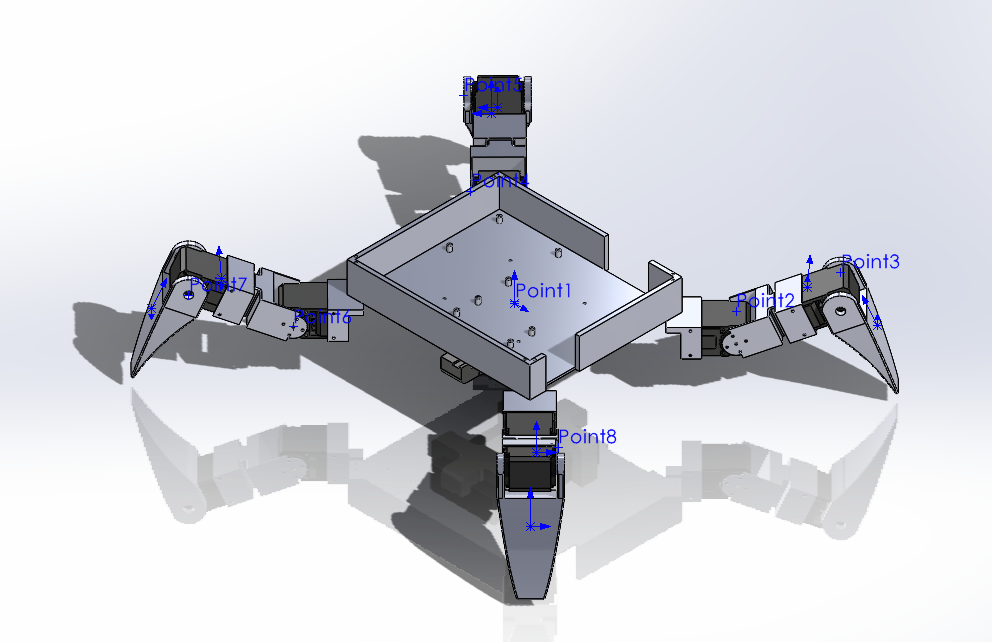
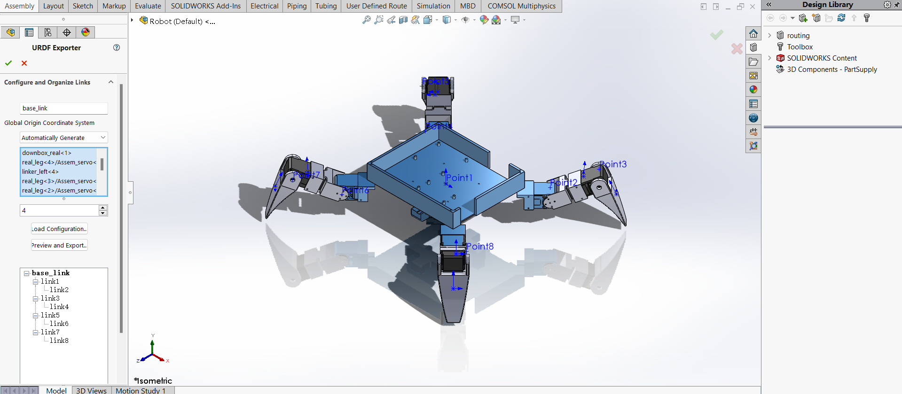
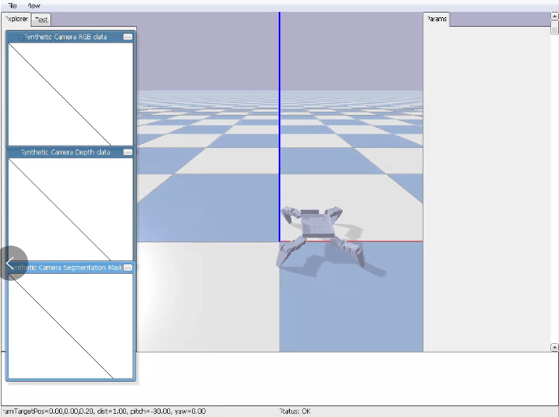
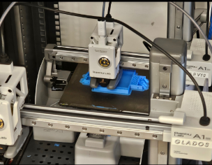
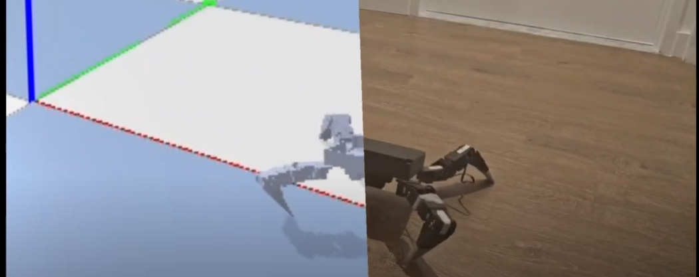

# Robot_Studio_Project

This project focuses on training "full-stack" roboticists, covering all aspects from kinematics and industrial design to manufacturing, electronics, simulation, and programming. (This project is still ongoing!)

## Simulation

### CAD design

First, I designed a simple bipedal crawling robot CAD and added servo motors, screws, and other details to ensure the accuracy of the design.

 
Figure 1. CAD of robot 

### URDF generation

Next, we used a SolidWorks plugin to determine the coordinates and rotation axes of the links and servos, and then exported the URDF file directly from SolidWorks using a ROS plugin for subsequent simulations.

 
Figure 2. urdf generation 

### Find a suitable motion gait to enable the robot to move forward

For this simple robot with four servos, I decided to use a sine function as the input for each servo. Through simulation, I will select the appropriate frequency, amplitude, and phase for each servo (urdf in simluation folder).

#### Using a genetic algorithm for simulation, find the optimal gait

For this robot, the input at each moment is an array containing 12 parameters (4 servos, each with 3 parameters: phase, frequency, and amplitude). I use a genetic algorithm based on the DEAP library to find the optimal 12 parameters, enabling the robot to move forward. (The simulation code is provided in simulation folder) The simulation environment is set up using PyBullet.

 
Figure 3. simulation of the best result in PyBullet 

## Manufacture

All the robot components (except for the screws, servos, and wires) were produced using a 3D printer. After appropriately slicing the STL files, the components were printed directly.

 
Figure 4. 3d printing the robot part 

## Result
Video can find on YouTube through this link: [https://www.youtube.com/watch?v=yAFkwFUbHYc](https://www.youtube.com/watch?v=RdD6Z4WlUA0)
It can be observed that although both the simulation and the real-world robot are moving forward, there are still significant differences in overall posture and speed. The possible reasons for this could be the variation in ground friction, as well as discrepancies in dimensions and initial conditions caused during the actual manufacturing process.
 
Figure 5. test result using same actuation method both simulation and real 
